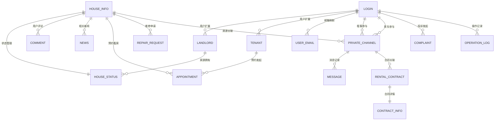

# 数据库设计文档

[](https://www.mysql.com/)
[](https://www.sqlalchemy.org/)

## 📋 目录

- [概述](#概述)
- [数据库架构](#数据库架构)
- [数据表详情](#数据表详情)
- [关系图谱](#关系图谱)
- [索引策略](#索引策略)
- [数据迁移](#数据迁移)
- [性能优化](#性能优化)

## 🗄️ 概述

智能房屋租赁系统采用MySQL 8.0作为主数据库，使用SQLAlchemy ORM进行数据建模和操作。数据库设计遵循第三范式，确保数据的一致性和完整性。

### 核心设计原则
- **数据完整性**: 通过外键约束确保数据关联的正确性
- **扩展性**: 支持系统功能的持续扩展
- **性能优化**: 合理的索引设计和查询优化
- **安全性**: 敏感数据加密存储，权限控制

## 🏗️ 数据库架构

### 模块划分

| 模块 | 表数量 | 主要功能 |
|------|--------|----------|
| **用户管理** | 4张表 | 用户认证、角色管理、邮箱映射 |
| **房源管理** | 4张表 | 房源信息、状态管理、审核流程 |
| **消息通讯** | 3张表 | 私信频道、消息记录、投诉反馈 |
| **租赁管理** | 4张表 | 预约看房、合同管理、维修申请 |
| **内容管理** | 2张表 | 新闻发布、评论互动 |
| **统计分析** | 3张表 | 出租率统计、访问统计、操作日志 |

## 📊 数据表详情

### 👥 用户管理模块

#### login - 用户登录表
```sql
CREATE TABLE `login` (
  `username` varchar(100) NOT NULL COMMENT '用户名（主键）',
  `password` varchar(100) NOT NULL COMMENT '密码（Argon2加密）',
  `type` int NOT NULL COMMENT '用户类型：0-管理员，1-租客，2-房东',
  PRIMARY KEY (`username`)
) ENGINE=InnoDB;
```

**字段说明**:
- `username`: 系统唯一标识，支持中英文
- `password`: 使用Argon2算法加密存储
- `type`: 枚举类型，控制用户权限和功能访问

#### landlord - 房东信息表
```sql
CREATE TABLE `landlord` (
  `landlord_name` varchar(100) NOT NULL COMMENT '房东用户名',
  `phone` varchar(255) NOT NULL COMMENT '联系电话',
  `addr` varchar(255) NOT NULL COMMENT '房东住址',
  PRIMARY KEY (`landlord_name`)
) ENGINE=InnoDB;
```

#### tenant - 租客信息表
```sql
CREATE TABLE `tenant` (
  `tenant_name` varchar(100) NOT NULL COMMENT '租客用户名',
  `phone` varchar(100) NOT NULL COMMENT '联系方式',
  `addr` varchar(255) NOT NULL COMMENT '用户住址',
  PRIMARY KEY (`tenant_name`)
) ENGINE=InnoDB;
```

#### user_email - 邮箱映射表
```sql
CREATE TABLE `user_email` (
  `id` int NOT NULL AUTO_INCREMENT,
  `email` varchar(255) NOT NULL COMMENT '用户邮箱',
  `username` varchar(100) NOT NULL COMMENT '关联的用户名',
  PRIMARY KEY (`id`),
  UNIQUE KEY `uq_email_username_map` (`email`, `username`),
  FOREIGN KEY (`username`) REFERENCES `login` (`username`) ON DELETE CASCADE
) ENGINE=InnoDB;
```

### 🏠 房源管理模块

#### house_info - 房源基本信息表
```sql
CREATE TABLE `house_info` (
  `house_id` int NOT NULL AUTO_INCREMENT COMMENT '房屋ID（主键）',
  `house_name` varchar(255) NOT NULL COMMENT '房屋名称',
  `rooms` varchar(100) NOT NULL COMMENT '房屋户型（如3室1厅）',
  `region` varchar(100) NOT NULL COMMENT '房屋地区',
  `addr` varchar(255) NOT NULL COMMENT '具体地址',
  `price` decimal(10,2) NOT NULL COMMENT '房屋价格',
  `deposit` decimal(10,2) DEFAULT NULL COMMENT '押金',
  `situation` varchar(255) DEFAULT NULL COMMENT '房屋装修情况',
  `highlight` varchar(255) DEFAULT NULL COMMENT '房屋亮点',
  `image` varchar(255) DEFAULT NULL COMMENT '房屋图片URL',
  PRIMARY KEY (`house_id`)
) ENGINE=InnoDB;
```

#### house_status - 房源状态表
```sql
CREATE TABLE `house_status` (
  `house_id` int NOT NULL COMMENT '房屋ID',
  `landlord_name` varchar(100) NOT NULL COMMENT '房东用户名',
  `status` int NOT NULL COMMENT '状态：0-空置，1-出租中，2-装修中',
  `phone` varchar(255) NOT NULL COMMENT '房屋联系方式',
  `update_time` datetime NOT NULL COMMENT '最后更新时间',
  PRIMARY KEY (`house_id`, `landlord_name`),
  FOREIGN KEY (`house_id`) REFERENCES `house_info` (`house_id`) ON DELETE CASCADE,
  FOREIGN KEY (`landlord_name`) REFERENCES `landlord` (`landlord_name`)
) ENGINE=InnoDB;
```

#### house_listing_audit - 房源审核表
```sql
CREATE TABLE `house_listing_audit` (
  `id` int NOT NULL AUTO_INCREMENT COMMENT '审核记录ID',
  `house_id` int NOT NULL COMMENT '房源ID',
  `house_name` varchar(255) NOT NULL COMMENT '房源名称',
  `landlord_name` varchar(100) NOT NULL COMMENT '房东名字',
  `audit_status` int NOT NULL DEFAULT '0' COMMENT '审核状态：0-审核中，1-已通过，2-已拒绝',
  `reason` varchar(255) DEFAULT NULL COMMENT '拒绝理由',
  `create_time` datetime NOT NULL DEFAULT CURRENT_TIMESTAMP COMMENT '申请时间',
  `update_time` datetime NOT NULL DEFAULT CURRENT_TIMESTAMP ON UPDATE CURRENT_TIMESTAMP COMMENT '回复时间',
  PRIMARY KEY (`id`),
  FOREIGN KEY (`house_id`, `landlord_name`) REFERENCES `house_status` (`house_id`, `landlord_name`) ON DELETE CASCADE
) ENGINE=InnoDB;
```

#### comment - 房源评论表
```sql
CREATE TABLE `comment` (
  `comment_id` int NOT NULL AUTO_INCREMENT,
  `house_id` int NOT NULL COMMENT '房屋ID',
  `username` varchar(255) NOT NULL COMMENT '留言人名字',
  `type` int NOT NULL COMMENT '留言人类型：1-租客，2-房东',
  `desc` varchar(255) NOT NULL COMMENT '留言内容',
  `at` int DEFAULT NULL COMMENT '@哪条留言',
  `time` datetime NOT NULL COMMENT '留言时间',
  PRIMARY KEY (`comment_id`),
  FOREIGN KEY (`house_id`) REFERENCES `house_info` (`house_id`) ON DELETE CASCADE
) ENGINE=InnoDB;
```

### 💬 消息通讯模块

#### private_channel - 私信频道表
```sql
CREATE TABLE `private_channel` (
  `channel_id` int NOT NULL AUTO_INCREMENT,
  `tenant_username` varchar(100) NOT NULL COMMENT '租客用户名',
  `landlord_username` varchar(100) NOT NULL COMMENT '房东用户名',
  `house_id` int NOT NULL COMMENT '关联的房屋ID',
  `created_at` datetime NOT NULL DEFAULT CURRENT_TIMESTAMP COMMENT '频道创建时间',
  PRIMARY KEY (`channel_id`),
  UNIQUE KEY `uq_tenant_landlord_house` (`tenant_username`, `landlord_username`, `house_id`),
  FOREIGN KEY (`tenant_username`) REFERENCES `login` (`username`),
  FOREIGN KEY (`landlord_username`) REFERENCES `login` (`username`),
  FOREIGN KEY (`house_id`) REFERENCES `house_info` (`house_id`) ON DELETE CASCADE
) ENGINE=InnoDB;
```

#### message - 消息记录表
```sql
CREATE TABLE `message` (
  `message_id` int NOT NULL AUTO_INCREMENT,
  `channel_id` int NOT NULL COMMENT '所属私信频道的ID',
  `sender_username` varchar(100) NOT NULL COMMENT '发送者用户名',
  `receiver_username` varchar(100) NOT NULL COMMENT '接收者用户名',
  `content` text NOT NULL COMMENT '消息内容',
  `timestamp` datetime NOT NULL COMMENT '发送时间',
  `is_read` tinyint(1) NOT NULL DEFAULT '0' COMMENT '是否已读',
  PRIMARY KEY (`message_id`),
  FOREIGN KEY (`channel_id`) REFERENCES `private_channel` (`channel_id`) ON DELETE CASCADE,
  FOREIGN KEY (`sender_username`) REFERENCES `login` (`username`),
  FOREIGN KEY (`receiver_username`) REFERENCES `login` (`username`)
) ENGINE=InnoDB;
```

#### complaint - 投诉反馈表
```sql
CREATE TABLE `complaint` (
  `complaint_id` int NOT NULL AUTO_INCREMENT COMMENT '投诉/消息ID',
  `sender` varchar(100) NOT NULL COMMENT '发送人用户名',
  `receiver` varchar(100) DEFAULT NULL COMMENT '接收人用户名（为空表示所有管理员可见）',
  `content` text NOT NULL COMMENT '消息/投诉内容',
  `time` datetime NOT NULL DEFAULT CURRENT_TIMESTAMP COMMENT '发送时间',
  `type` varchar(20) NOT NULL DEFAULT '投诉' COMMENT '类型：投诉/反馈',
  `status` varchar(20) NOT NULL DEFAULT '待处理' COMMENT '处理状态',
  `handler_username` varchar(100) DEFAULT NULL COMMENT '处理人用户名',
  `last_updated_time` datetime NOT NULL DEFAULT CURRENT_TIMESTAMP ON UPDATE CURRENT_TIMESTAMP COMMENT '最后更新时间',
  `update_seen_by_sender` tinyint(1) NOT NULL DEFAULT '0' COMMENT '发送者是否已查看最新状态更新',
  PRIMARY KEY (`complaint_id`),
  FOREIGN KEY (`sender`) REFERENCES `login` (`username`)
) ENGINE=InnoDB;
```

### 📋 租赁管理模块

#### appointment - 预约看房表
```sql
CREATE TABLE `appointment` (
  `appointment_id` int NOT NULL AUTO_INCREMENT COMMENT '预约ID',
  `house_id` int NOT NULL COMMENT '房屋ID',
  `house_name` varchar(255) NOT NULL COMMENT '房屋名称',
  `tenant_name` varchar(100) NOT NULL COMMENT '租客用户名',
  `landlord_name` varchar(100) NOT NULL COMMENT '房东用户名',
  `appointment_time` datetime NOT NULL COMMENT '预约时间',
  `status` varchar(20) NOT NULL DEFAULT '申请中' COMMENT '预约状态',
  PRIMARY KEY (`appointment_id`),
  FOREIGN KEY (`house_id`) REFERENCES `house_info` (`house_id`) ON DELETE CASCADE,
  FOREIGN KEY (`tenant_name`) REFERENCES `tenant` (`tenant_name`) ON DELETE CASCADE,
  FOREIGN KEY (`landlord_name`) REFERENCES `landlord` (`landlord_name`) ON DELETE CASCADE
) ENGINE=InnoDB;
```

#### rental_contract - 租赁合同表
```sql
CREATE TABLE `rental_contract` (
  `id` int NOT NULL AUTO_INCREMENT COMMENT '订单号（主键）',
  `channel_id` int NOT NULL COMMENT '关联的私信频道ID',
  `landlord_username` varchar(100) NOT NULL,
  `tenant_username` varchar(100) NOT NULL,
  `start_date` date NOT NULL,
  `end_date` date NOT NULL,
  `total_amount` decimal(10,2) NOT NULL COMMENT '月租金或其他周期性租金总额',
  `status` int NOT NULL DEFAULT '0' COMMENT '合同状态',
  `created_at` datetime DEFAULT CURRENT_TIMESTAMP,
  `updated_at` datetime DEFAULT CURRENT_TIMESTAMP ON UPDATE CURRENT_TIMESTAMP,
  PRIMARY KEY (`id`),
  FOREIGN KEY (`channel_id`) REFERENCES `private_channel` (`channel_id`) ON DELETE CASCADE
) ENGINE=InnoDB;
```

**合同状态说明**:
- `0`: 待签署
- `1`: 已签署待支付
- `2`: 已取消
- `3`: 已撤销
- `4`: 已支付/合同生效
- `5`: 已到期
- `6`: 已终止/已归还

#### contract_info - 合同详细信息表
```sql
CREATE TABLE `contract_info` (
  `rental_contract_id` int NOT NULL COMMENT '关联的RentalContract订单号（主键）',
  `contract_document_id` varchar(50) DEFAULT NULL COMMENT '合同示范文本编号',
  `house_details_text_snapshot` text COMMENT '房屋坐落、权属、面积、户型等描述',
  `lease_purpose_text` text COMMENT '租赁用途',
  `rent_payment_frequency` varchar(50) DEFAULT NULL COMMENT '租金支付频率',
  `landlord_bank_account_info` text COMMENT '甲方收款账户信息',
  `deposit_amount_numeric_snapshot` decimal(10,2) DEFAULT NULL COMMENT '押金金额数字快照',
  `other_agreements_text` text COMMENT '其他约定事项全文',
  `handover_checklist_details_text` text COMMENT '房屋交割单详细内容',
  `landlord_signature_identifier` varchar(255) DEFAULT NULL COMMENT '甲方签名标识',
  `landlord_signature_datetime` datetime DEFAULT NULL COMMENT '甲方签名时间',
  `tenant_signature_identifier` varchar(255) DEFAULT NULL COMMENT '乙方签名标识',
  `tenant_signature_datetime` datetime DEFAULT NULL COMMENT '乙方签名时间',
  `landlord_handover_signature_identifier` varchar(255) DEFAULT NULL COMMENT '交割单甲方签名标识',
  `landlord_handover_signature_datetime` datetime DEFAULT NULL COMMENT '交割单甲方签名时间',
  `tenant_handover_signature_identifier` varchar(255) DEFAULT NULL COMMENT '交割单乙方签名标识',
  `tenant_handover_signature_datetime` datetime DEFAULT NULL COMMENT '交割单乙方签名时间',
  `info_created_at` datetime DEFAULT CURRENT_TIMESTAMP,
  `info_updated_at` datetime DEFAULT CURRENT_TIMESTAMP ON UPDATE CURRENT_TIMESTAMP,
  PRIMARY KEY (`rental_contract_id`),
  FOREIGN KEY (`rental_contract_id`) REFERENCES `rental_contract` (`id`) ON DELETE CASCADE
) ENGINE=InnoDB;
```

#### repair_request - 维修申请表
```sql
CREATE TABLE `repair_request` (
  `id` int NOT NULL AUTO_INCREMENT,
  `house_id` int NOT NULL COMMENT '关联房屋ID',
  `tenant_username` varchar(100) NOT NULL COMMENT '租客用户名',
  `landlord_username` varchar(100) NOT NULL COMMENT '房东用户名',
  `content` text NOT NULL COMMENT '维修内容描述',
  `request_time` datetime NOT NULL DEFAULT CURRENT_TIMESTAMP COMMENT '请求发起时间',
  `status` varchar(50) NOT NULL DEFAULT '请求中' COMMENT '维修请求状态',
  `handler_notes` text COMMENT '房东处理备注',
  `handled_time` datetime DEFAULT NULL COMMENT '房东处理时间',
  PRIMARY KEY (`id`),
  FOREIGN KEY (`house_id`) REFERENCES `house_info` (`house_id`) ON DELETE CASCADE,
  FOREIGN KEY (`tenant_username`) REFERENCES `login` (`username`) ON DELETE CASCADE,
  FOREIGN KEY (`landlord_username`) REFERENCES `login` (`username`) ON DELETE CASCADE
) ENGINE=InnoDB;
```

### 📰 内容管理模块

#### news - 新闻资讯表
```sql
CREATE TABLE `news` (
  `id` int NOT NULL AUTO_INCREMENT,
  `time` datetime NOT NULL COMMENT '新闻发布时间',
  `house_id` int NOT NULL COMMENT '房屋ID',
  `title` varchar(255) NOT NULL COMMENT '新闻标题',
  `desc` varchar(255) DEFAULT NULL COMMENT '新闻内容',
  `landlord_username` varchar(100) DEFAULT NULL COMMENT '新闻发布者（房东）',
  PRIMARY KEY (`id`),
  FOREIGN KEY (`house_id`) REFERENCES `house_info` (`house_id`) ON DELETE CASCADE ON UPDATE CASCADE,
  FOREIGN KEY (`landlord_username`) REFERENCES `login` (`username`)
) ENGINE=InnoDB;
```

### 📊 统计分析模块

#### daily_rent_rate - 每日出租率统计表
```sql
CREATE TABLE `daily_rent_rate` (
  `id` int NOT NULL AUTO_INCREMENT COMMENT '自增ID',
  `date` date NOT NULL COMMENT '统计日期',
  `total_count` int NOT NULL DEFAULT '0' COMMENT '上架总数（状态为0）',
  `rented_count` int NOT NULL DEFAULT '0' COMMENT '出租数（状态为1）',
  `rent_rate` decimal(5,2) NOT NULL COMMENT '出租率百分比',
  PRIMARY KEY (`id`),
  UNIQUE KEY `date` (`date`)
) ENGINE=InnoDB;
```

#### visit_stats - 访问统计表
```sql
CREATE TABLE `visit_stats` (
  `id` int NOT NULL AUTO_INCREMENT,
  `visit_date` date NOT NULL,
  `unique_visits` int DEFAULT '0',
  `created_at` datetime DEFAULT CURRENT_TIMESTAMP,
  PRIMARY KEY (`id`)
) ENGINE=InnoDB;
```

#### operation_log - 操作日志表
```sql
CREATE TABLE `operation_log` (
  `id` int NOT NULL AUTO_INCREMENT,
  `username` varchar(64) NOT NULL,
  `user_type` int NOT NULL COMMENT '0-管理员，1-会员，2-房东',
  `message` text NOT NULL,
  `ip_address` varchar(45) DEFAULT NULL,
  `created_at` datetime DEFAULT CURRENT_TIMESTAMP,
  PRIMARY KEY (`id`)
) ENGINE=InnoDB;
```

## 🔗 关系图谱

### 核心实体关系



### 业务流程关系

| 业务流程 | 涉及表 | 关系描述 |
|----------|--------|----------|
| **用户注册** | `login` → `landlord/tenant` → `user_email` | 创建登录账户 → 扩展角色信息 → 绑定邮箱 |
| **房源发布** | `house_info` → `house_status` → `house_listing_audit` | 房源信息 → 状态管理 → 审核流程 |
| **租赁流程** | `private_channel` → `message` → `rental_contract` → `contract_info` | 建立沟通 → 协商细节 → 签署合同 → 详细条款 |
| **维修管理** | `repair_request` → `message` | 维修申请 → 沟通处理 |

## 📈 索引策略

### 主要索引

| 表名 | 索引类型 | 字段 | 用途 |
|------|----------|------|------|
| `house_info` | PRIMARY | `house_id` | 主键索引 |
| `house_status` | PRIMARY | `house_id`, `landlord_name` | 复合主键 |
| `house_status` | INDEX | `status` | 状态查询优化 |
| `message` | INDEX | `channel_id`, `timestamp` | 消息查询优化 |
| `private_channel` | UNIQUE | `tenant_username`, `landlord_username`, `house_id` | 防重复创建 |
| `daily_rent_rate` | UNIQUE | `date` | 日期唯一性 |
| `user_email` | UNIQUE | `email`, `username` | 邮箱映射唯一性 |

### 查询优化建议

```sql
-- 高频查询的索引优化
CREATE INDEX idx_house_region_status ON house_info(region);
CREATE INDEX idx_house_price_range ON house_info(price);
CREATE INDEX idx_message_unread ON message(receiver_username, is_read);
CREATE INDEX idx_appointment_status ON appointment(status, appointment_time);
```

## 🔄 数据迁移

### Alembic迁移管理

系统使用Flask-Migrate（基于Alembic）进行数据库版本控制：

```bash
# 生成迁移文件
flask db migrate -m "描述改动内容"

# 执行迁移
flask db upgrade

# 回滚迁移
flask db downgrade
```

### 当前迁移版本

```sql
SELECT version_num FROM alembic_version;
-- 当前版本: a13638c5c4d9
```

### 重要迁移历史

| 版本 | 日期 | 改动内容 |
|------|------|----------|
| `a13638c5c4d9` | 2025-06-04 | 完善合同详情表结构 |
| `前序版本` | 2025-05-30 | 添加维修申请模块 |
| `初始版本` | 2025-04-01 | 基础表结构创建 |

## ⚡ 性能优化

### 查询优化策略

#### 1. 房源搜索优化
```sql
-- 优化前：全表扫描
SELECT * FROM house_info WHERE region LIKE '%北京%';

-- 优化后：使用索引
SELECT hi.*, hs.status 
FROM house_info hi 
JOIN house_status hs ON hi.house_id = hs.house_id 
WHERE hi.region = '北京市朝阳区' AND hs.status = 0;
```

#### 2. 消息查询优化
```sql
-- 分页查询未读消息
SELECT * FROM message 
WHERE receiver_username = 'username' AND is_read = 0 
ORDER BY timestamp DESC 
LIMIT 20 OFFSET 0;
```

#### 3. 统计查询优化
```sql
-- 使用聚合查询优化出租率统计
SELECT 
    COUNT(*) as total_count,
    COUNT(CASE WHEN status = 1 THEN 1 END) as rented_count,
    ROUND(COUNT(CASE WHEN status = 1 THEN 1 END) * 100.0 / COUNT(*), 2) as rent_rate
FROM house_status;
```

### 缓存策略

#### Redis缓存应用
```python
# 热门房源缓存
CACHE_KEY_HOT_HOUSES = "hot_houses"
CACHE_TTL = 3600  # 1小时

# 用户会话缓存
CACHE_KEY_USER_SESSION = "user_session:{username}"
SESSION_TTL = 86400  # 24小时

# 搜索结果缓存
CACHE_KEY_SEARCH_RESULT = "search:{region}:{rooms}:{page}"
SEARCH_TTL = 1800  # 30分钟
```

### 数据库连接优化

```python
# SQLAlchemy连接池配置
SQLALCHEMY_ENGINE_OPTIONS = {
    'pool_size': 20,
    'pool_recycle': 3600,
    'pool_pre_ping': True,
    'max_overflow': 30
}
```

## 🔧 维护和监控

### 定期维护任务

#### 1. 数据清理
```sql
-- 清理过期的访问统计（保留3个月）
DELETE FROM visit_stats 
WHERE visit_date < DATE_SUB(CURDATE(), INTERVAL 3 MONTH);

-- 清理已读消息（保留1年）
DELETE FROM message 
WHERE is_read = 1 AND timestamp < DATE_SUB(NOW(), INTERVAL 1 YEAR);
```

#### 2. 索引维护
```sql
-- 分析表统计信息
ANALYZE TABLE house_info, house_status, message;

-- 优化表结构
OPTIMIZE TABLE house_info, house_status, message;
```


## 📚 相关文档

- [Flask-SQLAlchemy 官方文档](https://flask-sqlalchemy.palletsprojects.com/)
- [Flask-Migrate 迁移指南](https://flask-migrate.readthedocs.io/)
- [MySQL 8.0 参考手册](https://dev.mysql.com/doc/refman/8.0/en/)
- [Alembic 官方文档](https://alembic.sqlalchemy.org/)

---

**注意**: 在生产环境中，请确保定期备份数据库，并测试恢复流程。建议使用MySQL的主从复制或MGR集群来提高可用性。